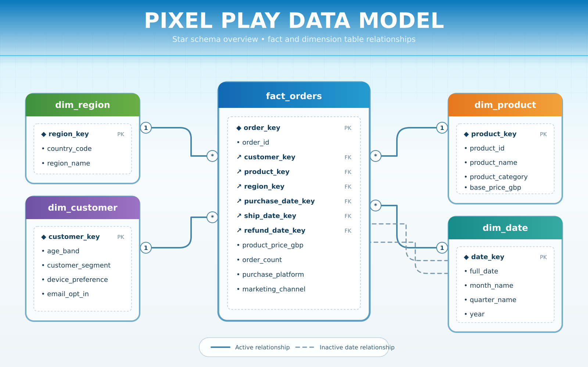
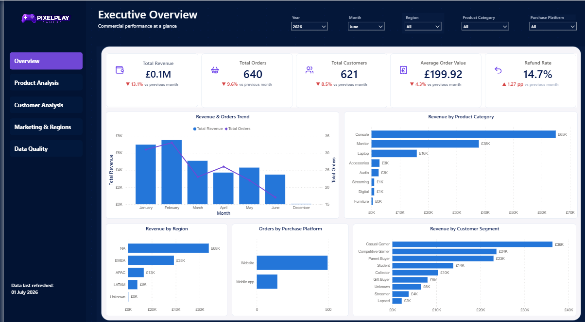
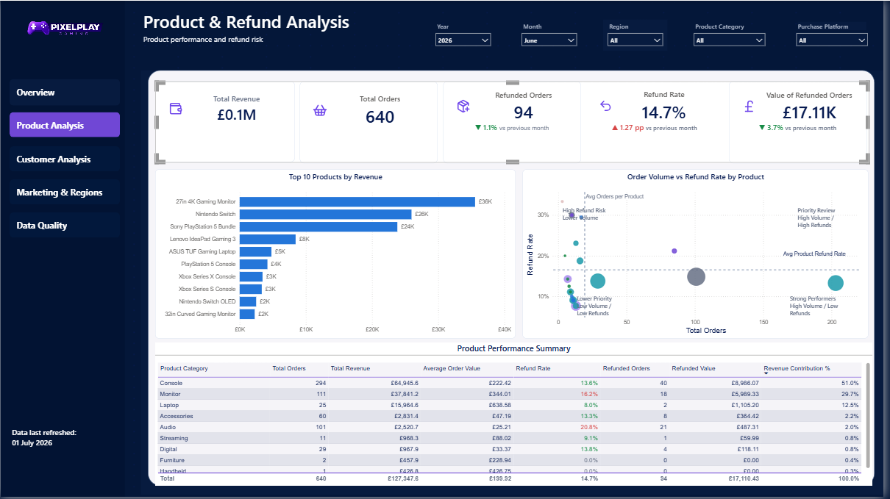
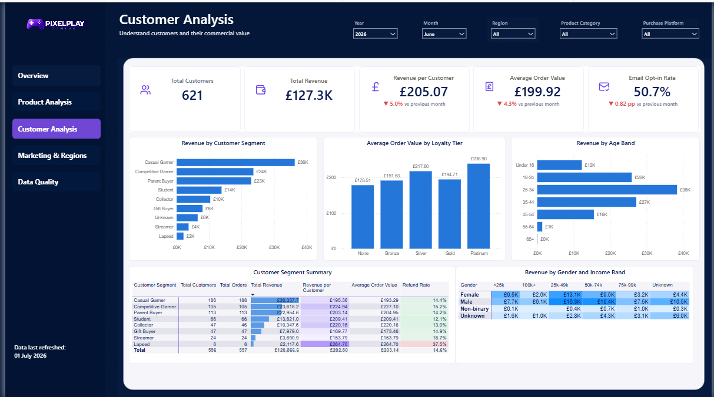
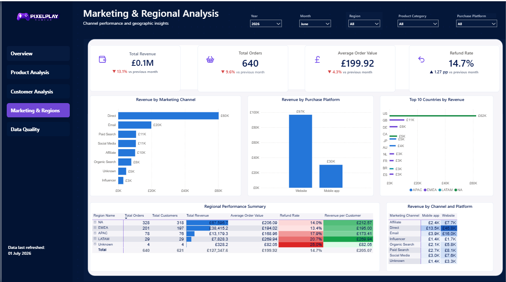
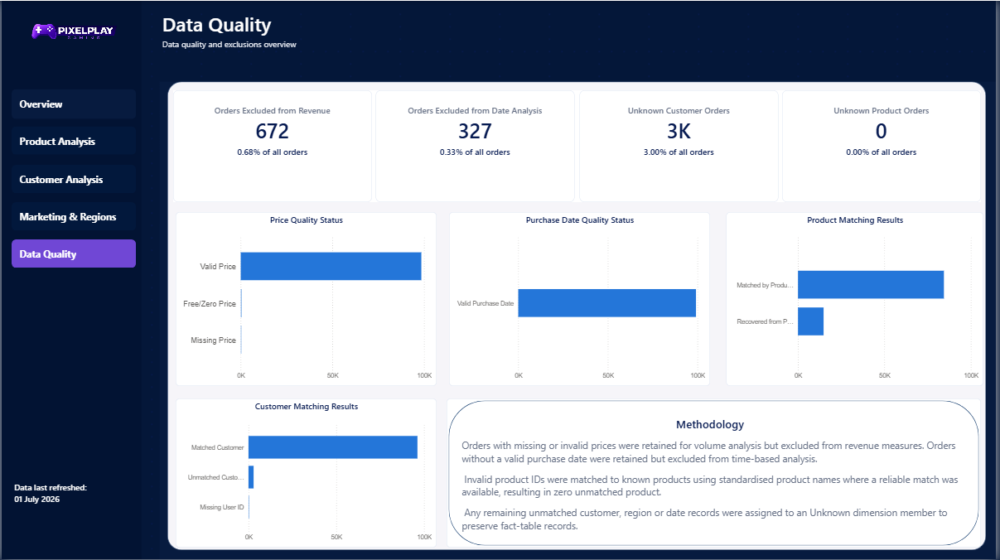

# 🎮 PixelPlay Sales & Customer Analytics

> End-to-end data analytics project using SQL Server and Power BI to analyse sales performance, customer behaviour, product performance, regional trends and refunds.

## Business Problem

PixelPlay is a fictional gaming retailer with transactional data covering customers, products, regions, sales and refunds. However, the data is spread across multiple raw datasets and contains inconsistencies and data-quality issues, making it difficult to produce a reliable, consolidated view of business performance. 

Stakeholders require a trusted reporting solution that brings this information together and provides clear visibility of revenue, order volumes, customer behaviour, product performance, regional trends and refunds to support more informed commercial decision-making.


## Executive Summary

PixelPlay Gaming's June 2026 performance weakened across every headline KPI. Revenue fell to £127.3K, down 13.1% month on month, while orders declined 9.6% and customers fell 8.5%. Average order value also decreased 4.3% to £199.92, showing that the decline was driven by both lower transaction volume and reduced spend per order. At the same time, the refund rate increased 1.27 percentage points to 14.7%, adding further pressure to retained revenue.

The wider trend also warrants attention: revenue peaked in February and then declined for four consecutive months through June. Performance is highly concentrated, with Console and Monitor generating 81% of revenue, NA and EMEA contributing 83% of regional revenue, and the Direct channel and Website platform accounting for the largest shares of channel and platform revenue.

## Key Insights

### Commercial Performance
- June revenue declined to £127.3K, down 13.1% month on month, alongside a 9.6% fall in orders and an 8.5% reduction in customers.

- Average order value decreased 4.3% to £199.92, meaning weaker revenue performance reflected both lower order volume and reduced spend per transaction.

- Revenue peaked in February and then declined for four consecutive months through June, suggesting a sustained slowdown rather than a single weak period.
### Product Concentration & Refund Risk
- Console (51%) and Monitor (30%) generated 81% of June revenue, with Laptop contributing a further 12.5%.
- Monitor recorded a 16.2% refund rate, above the overall 14.7% rate, making it particularly important because of its large revenue contribution.

- Audio had the highest category refund rate at 20.8%, indicating that refund risk is not limited to the largest revenue categories.
### Customer Performance
- Casual Gamer was the largest customer segment by both volume and revenue in June.
- Revenue per customer fell 5.0%, reinforcing the wider evidence of weakening customer economics.
- Platinum loyalty customers recorded the highest average order value, indicating a clear association between higher loyalty tier and stronger spend per order.

- Email opt-in stood at 50.7% and was trending down, reducing the audience available for retention and re-engagement activity.
### Channel & Regional Performance
- NA (£68K) and EMEA (£38K) generated 83% of regional revenue, while the US alone contributed approximately £62K.
- The Direct channel generated £60K and Website purchases generated £97K, highlighting a strong dependency on a narrow set of routes to market.

- LATAM (20.7%) and APAC (17.9%) recorded higher refund rates than NA (14.0%) and EMEA (13.4%), meaning regional growth should be assessed alongside refund performance rather than revenue alone.

## Business Recommendations

### 1. Product & Merchandising 
*Prioritise high-value refund reduction*

#### Finding:
- Audio (20.8%) and Monitor (16.2%) refund rates are above the overall 14.7% rate, while Monitor alone contributes 30% of total revenue.

#### Business Impact:
- Elevated refunds are eroding retained revenue within commercially important categories, with Monitor presenting the greatest potential exposure because of its revenue weight.

#### Recommendation:
- Run a root-cause analysis of Audio and Monitor refunds before applying a single corrective action. Review available evidence for product defects, compatibility issues, listing clarity and customer expectations, recognising that the underlying cause may differ by category.

#### Expected Impact: 
- A potential reduction in avoidable refunds and stronger retained revenue, with the greatest potential revenue protection coming from improvements within the Monitor product range.

### 2. Commercial / Finance  
*Diagnose the four-month revenue decline*

#### Finding:
-  Revenue has declined for four consecutive months following the February peak.

#### Business Impact:
- If the decline continues without its drivers being isolated, PixelPlay faces greater uncertainty around demand, short-term targets and Q3 forecasting.

#### Recommendation:
- Break the decline down by product category, region, customer segment and purchase platform to determine whether the slowdown is affecting the business more widely or is concentrated in a small number of areas. 
Use the results to distinguish a wider demand issue from a category- or market-specific problem.

#### Expected Impact:
- A more accurate diagnosis of the slowdown, enabling a targeted commercial response and more realistic short-term forecasting.

### 3. Customer & CRM 
*Strengthen retention reach before testing loyalty growth*

#### Finding: 
- Platinum-tier customers have the highest average order value, while email opt-in is only 50.7% and declining.

#### Business Impact: 
- PixelPlay has a high-value loyalty segment but a shrinking addressable audience for retention and re-engagement activity.

#### Recommendation: 
- First review the voluntary email opt-in journey, messaging and customer touchpoints to identify opportunities to improve consent rates. Once reach improves, test targeted loyalty and tier-progression campaigns among suitable Gold and Silver customers rather than assuming that movement to a higher tier will automatically increase spend.

#### Expected Impact: 
- Greater retention marketing reach and stronger evidence on whether targeted loyalty engagement can increase customer value.

### 4. Marketing & E-commerce

*Reduce concentration risk while protecting revenue quality*

#### Finding: 
- Direct and Website dominate channel and platform revenue, while LATAM (20.7%) and APAC (17.9%) carry elevated refund rates.

#### Business Impact: 
- Heavy channel concentration creates dependency risk, while increasing acquisition activity in high-refund regions could grow revenue that is disproportionately offset by returns.

#### Recommendation: 
- Investigate the causes of elevated refunds in LATAM and APAC before materially expanding acquisition activity in those regions. Separately, test opportunities to diversify acquisition through underrepresented channels such as Paid Search, Social and Affiliate without reducing support for the strongest existing routes to market.

#### Expected Impact: 
- A more diversified acquisition mix and regional growth that delivers stronger retained revenue rather than being disproportionately eroded by refunds.

## Project Objectives

- Clean and validate the raw datasets to create a reliable reporting foundation.

- Consolidate customer, product, regional and transactional data into a structured reporting model.

- Analyse revenue, orders, customer behaviour, product performance and refunds to identify meaningful trends.

- Build an interactive Power BI dashboard that enables stakeholders to monitor performance across key business areas.

- Produce clear, evidence-based insights and recommendations to support commercial decision-making.

## Business Questions

- How are revenue and order volumes performing over time?

- Which products and product categories generate the most revenue and orders?

- Which customer segments contribute the greatest value to the business?

- How does performance vary across regions and markets?

- Where are refunds concentrated, and which products or customer groups have the highest refund rates?

- What trends and patterns can be identified to support future decision-making?

[View supporting SQL analysis →](sql/05_business_analysis.sql)

## Dataset

The project uses four core datasets covering transactional, customer, product and regional information.

| Dataset | Description |
|---|---|
| Orders | Transactional level data including purchase dates, product prices, shipping and refund information |
| Customers | Customer attributes including demographics, signup information and email opt-in status |
| Products | Product details including product names, categories and pricing |
| Regions | Geographic reference data used to group customers and transactions by market |

## Tools & Technologies

| Tool | Use in Project |
|---|---|
| **Excel** | Initial data inspection and profiling |
| **SQL Server** | Data cleaning, transformation, validation and business analysis |
| **Power BI** | Data modelling, dashboard development and interactive reporting |
| **Power Query** | Additional data preparation and transformation |
| **DAX** | KPI measures, time intelligence and dynamic calculations |
| **VS Code** | Project file management and documentation |
| **Git & GitHub** | Version control and project portfolio hosting |

## Data Cleaning & Transformation

The raw datasets were profiled and cleaned in SQL Server before being used for analysis. Key transformations included:

- Standardised and validated purchase, shipping, refund and customer signup dates.

- Identified invalid date sequences, including shipments or refunds occurring before the original purchase.
- Validated product prices and applied rules to prevent invalid or missing values from affecting revenue calculations.
- Standardised customer email opt-in values and validated demographic fields such as age.
- Cleaned inconsistent product, country and regional classifications.
- Reconciled product and customer identifiers across datasets to support reliable relationships.
- Created analysis flags to control which records were eligible for revenue, trend and refund calculations.

Rather than automatically deleting records with data-quality issues, transactions were retained where they remained valid for other forms of analysis. Measure-specific rules were then used to exclude unreliable records only from the calculations they could affect.

[View data cleaning scripts →](sql/02_data_cleaning/)

## Data Quality & Validation

Validation checks were performed in SQL Server after cleaning to confirm that the transformed data was suitable for analysis and reporting.

Key checks included:

- Missing or invalid purchase dates.

- Shipping dates occurring before purchase dates.
- Refund dates occurring before purchase dates.
- Invalid or missing product prices.
- Unmatched customer, product and regional records.
- Duplicate business keys and transaction row counts.
- Revenue and date-analysis eligibility flags.
- KPI reconciliation between SQL Server and Power BI.

Data-quality flags were retained in the analytical model so unreliable records could be excluded only from the calculations they affected, rather than removing otherwise usable transactions.

[View post-cleaning validation →](sql/03_post_cleaning_validation.sql)

[View final validation →](sql/06_final_validation.sql)


## Data Model

A star schema was created to organise the cleaned data into a structure suitable for reporting and analysis.

The model uses `fact_orders` as the central fact table, supported by dimension tables for customers, products, regions and dates.

- `fact_orders` – transactional order data, measures and analysis flags
- `dim_customer` – customer attributes and segmentation
- `dim_product` – product and category information
- `dim_region` – geographic information
- `dim_date` – calendar fields used for trend and time-intelligence analysis

This structure reduces duplication, improves reporting consistency and supports reliable one-to-many relationships between the dimensions and the fact table.

### Star Schema



[View star schema SQL →](sql/04_star_schema/)


## Power BI & DAX

Power BI was used to turn the validated data model into an interactive reporting solution focused on commercial, customer and operational performance.

Key functionality included:

- KPI reporting for revenue, orders, customers, average order value, revenue per customer and refund rate.

- Month-over-month calculations to monitor changes in key performance indicators.
- Time-intelligence measures for analysing performance across reporting periods.
- Interactive slicers for date, region, product category and purchase platform.
- Customer and product segmentation to identify key revenue drivers and behavioural patterns.
- Conditional formatting and visual cues to highlight performance changes and areas requiring attention.
- Consistent DAX eligibility logic so only appropriate transactions contributed to revenue and date-based calculations.

The dashboard was designed to allow stakeholders to move from a high-level performance overview into more detailed product, customer, marketing and regional analysis.

[download the Power BI report →](PowerBI/PixelPlay_Analytics.pbix)

## Dashboard

The final Power BI dashboard provides an interactive view of PixelPlay's performance across commercial KPIs, products, customers, marketing channels, regions and data quality.

### Executive Overview

Provides a high-level view of revenue, orders, customers, average order value and refund rate, supported by trend, product category, regional and customer-segment analysis.



### Product & Refund Analysis

Focuses on product performance, revenue contribution and refund behaviour, helping identify strong-performing products and areas of refund risk.



### Customer Analysis

Explores customer value, segmentation and behavioural patterns, including revenue per customer, average order value, loyalty tier, age band and email opt-in performance.



### Marketing & Regional Analysis

Compares performance across marketing channels, purchase platforms, regions and countries to highlight where revenue and demand are being generated.



### Data Quality Summary

Provides visibility of excluded records, matching outcomes and data-quality controls used to support reliable reporting.



## Limitations

The following limitations should be considered when interpreting the analysis:

- Orders with missing or invalid purchase dates could not be included in time-based analysis.

- Unmatched or unknown customer records provide less detail for customer segmentation.
- Refund data identifies where refunds occurred but does not include refund reasons, limiting root-cause analysis.
- The dataset does not include product costs or profit margins, so revenue performance should not be interpreted as profitability.
- Marketing spend is not available, so customer acquisition cost and return on marketing investment cannot be calculated.

## Repository Structure

```text
PixelPlay-Analytics/
│
├── README.md
│
├── sql/
│   ├── 01_data_profiling.sql
│   │
│   ├── 02_data_cleaning/
│   │   ├── clean_region.sql
│   │   ├── clean_products.sql
│   │   ├── clean_customers.sql
│   │   └── clean_orders.sql
│   │
│   ├── 03_data_validation.sql
│   │
│   ├── 04_star_schema/
│   │   ├── dim_customer.sql
│   │   ├── dim_product.sql
│   │   ├── dim_region.sql
│   │   ├── dim_date.sql
│   │   ├── fact_orders.sql
│   │   
│   │
│   ├── 05_business_analysis.sql
│   └── 06_final_validation.sql
│
├── Images/
│   ├── data-model.png
│   ├── executive-overview-v2.png
│   ├── product-refund-analysis-v2.png
│   ├── customer-analysis-v2.png
│   ├── marketing-regional-analysis-v2.png
│   └── data-quality-summary-v2.png
│
└── PowerBI/
    └── PixelPlay_Analytics.pbix